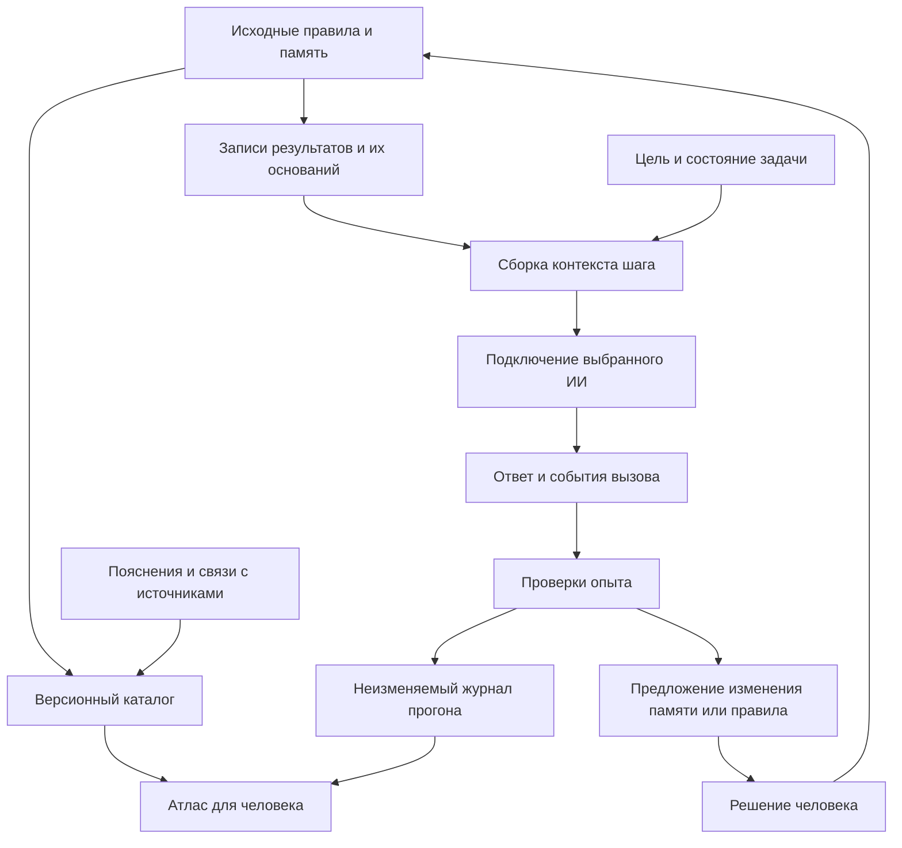

# Архитектура атласа и лаборатории протокола

Дата: 2026-09-30. Статус: рабочая архитектура реализации. Архитектурный этап завершён, граница переключения модели сообщена, пользователь поручил продолжить интерфейсный этап. Новые правила памяти и изменения регулятора остаются предложениями до проверки и принятия; исходный `PROTOCOL.md` ими не заменён.

## Состояние реализации

Локальный атлас, карта требований, версионная память SQLite, сборка контекста, симулятор C/D и пять условий лаборатории реализованы. Каталог проверяет полный перенос текста; карта требований покрывает 188 содержательных фрагментов. Смысловую полноту и применение правил не доказывают ни наличие карточки, ни наличие кода. Подробности работы — `WORKSPACE_GUIDE.md`; фактическая проверка и границы — `DELIVERY.md`.

Первоначальное описание ниже сохраняет архитектурный замысел. Реализованные расширения и их границы перечислены в конце.

## Назначение

Приложение должно позволять человеку понять весь протокол и исследовать его действие. Первый законченный результат: полный доступ к правилам и памяти, видимые основания правил и один воспроизводимый опыт сжатия и восстановления контекста. Язык интерфейса — русский, новые термины объясняются в месте использования.

## От потребности к устройству

| Потребность | Ограничение текущего средства | Средство в приложении | Проверка |
|---|---|---|---|
| Понять устройство протокола | Текст распределён между файлами | Полный каталог, поиск, схемы и переход в источник | Текст источников восстанавливается из каталога без потерь |
| Узнать, почему правило появилось | Правило и разбор ошибки находятся отдельно | Связь ошибки, правила, механизма и повторной проверки | Каждая показанная связь имеет источник либо помечена предложением |
| Продолжить работу после смены сессии | В кратком итоге могут исчезнуть основания | Версионная запись результата с источниками, условиями и открытыми вопросами | Новая сессия правильно продолжает контрольный эпизод |
| Ограничить объём входа | Вся история перегружает запрос, обрезка может удалить условие | Сборка контекста по текущей задаче и зависимостям | Не потеряны обязательные основания; переполнение показано явно |
| Исправить опровергнутый результат | Исправление одного текста не обновляет зависимые выводы | Обход зависимостей и очередь повторной проверки | Изменение опоры находит все известные зависимые записи |

Это перенос требований методологии в инженерные гипотезы. Наличие полей «потребность», «переход» и «результат» само по себе не доказывает вынужденность перехода или диалектическое качество рассуждения. Проверяется связь каждого предложенного механизма с конкретным обнаруженным ограничением.

## Слои и направления передачи

Атлас работает без вызовов моделей. Лаборатория получает отдельный вход, сохраняет ход запуска и выдаёт предложение пересмотра. Эксперимент не меняет действующий протокол и калибровку автоматически.

## Источники и производные данные

| Слой | Место | Кто меняет | Условие использования |
|---|---|---|---|
| Действующие тексты | `PROTOCOL.md`, `memory/*.md` | Человек или агент в рамках поручения | Показывать фактическую версию и исходный текст |
| Код текущей проверки | `check_answer.py` | Разработчик | Отделять реализованную эвристику от содержания требования |
| Редакторские пояснения | `atlas/annotations.json` | Разработчик; смысловые предложения утверждает человек | Уникальная цитата в источнике, статус и область действия |
| Каталог для экрана | `build/catalog.json` | Программа | Перестраивается; не редактируется вручную |
| Полные материалы запусков | `runs/<run_id>/` | Программа лаборатории | Отдельные запуски, без перезаписи прошлых |
| Индекс поиска и краткие представления | Производные файлы в `build/` | Программа | Перестраиваются из версионных источников |

Полные материалы хранятся один раз как исходники или снимки конкретного опыта. Краткие представления — производные с явной версией основания. Исчезновение файла или несовпадение версии не трактуется как отсутствие противоречия: запись получает состояние «источник недоступен» или «требует обновления».

Каталог сейчас включает все строки `PROTOCOL.md`, всех `memory/*.md`, `check_answer.py` и отдельного контракта стенда `docs/LAB_CONTRACT.md`. Автоматическая проверка доказывает полноту переноса текста. Она не доказывает, что каждое составное предложение разобрано на отдельные требования. Интерфейс показывает эти два состояния раздельно.

## Минимальная запись памяти

Предлагаемый контракт для лаборатории, ещё не реализованная замена существующим файлам:

| Поле | Смысл |
|---|---|
| `id`, `revision`, `parent_revision` | Постоянное имя записи, версия, предыдущая версия |
| `kind` | Факт, решение, гипотеза, ограничение, вопрос или результат проверки |
| `statement` | Что именно сохраняется |
| `need` | Какое ограничение предшествующего шага потребовало этой записи; может быть неизвестно |
| `basis` | Точные ссылки на источники или на версии других записей |
| `transition` | Краткое проверяемое обоснование перехода к результату; при отсутствии — явный пробел |
| `scope` | Где запись применима и какие исключения известны |
| `verification` | Метод, материал проверки, исход; отсутствие проверки тоже явное |
| `status` | Предложено, принято, отвергнуто, заменено или требует повторной проверки |
| `supersedes` | Какую запись заменяет; старую запись сохраняют |

Здесь «обоснование» означает доступные человеку основания и проверяемое объяснение. Внутренние скрытые рассуждения модели не требуются. Неизвестные поля не заполняются правдоподобным текстом ради полноты формы.

Ссылки «опирается на», «заменяет» и «противоречит» различаются. Замена опоры отправляет зависящие от неё выводы на проверку, но не объявляет их автоматически ложными. Обход зависимостей учитывает посещённые записи, чтобы циклическая ссылка не вызвала бесконечный обход. Обнаруженный цикл выводов отображается как проблема основания.

## Сборка контекста и сжатие

1. Программа читает цель, критерий готовности, текущий шаг, обязательные ограничения и нерешённые вопросы задачи.
2. Подбирает записи, нужные шагу. Для первого опыта достаточно явных ссылок и текстового поиска; внедрение поиска по смысловой близости должно быть обосновано отдельной потребностью.
3. Добавляет необходимую цепочку оснований, условия применимости и сведения о замене устаревших записей.
4. Сначала резервирует место для обязательных ограничений и ответа. Затем включает источники по потребности шага.
5. При переполнении уменьшает задачу либо заменяет полные материалы краткими представлениями с доступными ссылками. Обязательное основание не отрезается молча.
6. Записывает, какие версии вошли в запрос, какие не вошли и почему. Возврат к полному источнику фиксируется как отдельное событие.

Вводятся два разных режима опыта: самодостаточное краткое представление без чтения файлов и краткое представление с возможностью загрузить источник. Их стоимость и успешность считаются раздельно. Количество символов допустимо показывать как размер текста, но оно не называется точным количеством токенов.

Критерий сохранения смысла: новая сессия способна продолжить заданный эпизод, применить актуальные ограничения и указать основания. Прямое сравнение длины двух текстов этого не устанавливает. Устойчивость такой памяти остаётся исследовательской гипотезой.

## Выполнение и проверка

У запуска лаборатории состояния `prepared → running → completed | failed | cancelled`. `completed` означает окончание процедур, а не успешность ответа. Проверки имеют отдельные исходы `pass | fail | unknown | not_applicable`; нарушение формы, ошибка сервиса и содержательная ошибка не смешиваются.

Повтор запроса является новым событием с собственным идентификатором. Повторный ответ не стирает неудачный. Если данные расхода не вернулись, значение равно `null`. Отдельно учитываются запросы сжатия, восстановления, чтения источников, повторы и оценка, если она требует вызовов модели.

У каждого запроса сохраняются запрошенная и фактическая модели. Автоматическая замена модели в сравнительном опыте по умолчанию выключена; при разрешённой замене результат попадает в отдельную группу. Лимиты числа вызовов и времени обязательны. Денежная оценка выводится только с датой и источником тарифа, иначе показываются доступные токены и время.

Вторая модель может предложить замечания. Её согласие не является самостоятельным подтверждением правильности. Автоматическая проверка ссылок устанавливает наличие источника; верность вывода из источника требует отдельной проверки.

## Открытые развилки регулятора

В `atlas/annotations.json` зафиксированы четыре вопроса: порядок повышения C и пробного шага; надбавка поверх шкалы 0–12; восстановление D после двух успехов; выбор профиля при смене модели. Редакторские рекомендации не исполняются как принятые правила.

Для атласа и первого опыта с памятью эти вопросы не блокируют работу. Исполняемый регулятор откладывается до выбора однозначных переходов. Пороговые числа и «оценка внимания» не выводятся из уверенного самоотчёта ИИ.

## Техническая граница первой версии

Реализован Python-каталог на стандартной библиотеке, отдельный от проверки ответа. Интерфейс реализован локальной веб-страницей и Python-сервером на стандартной библиотеке. Первая версия читает каталог и показывает источники; ей не нужны модель, база данных или внешний хостинг. Внешних зависимостей нет.

Вызовы ИИ добавляются серверной частью лаборатории. Подключения из соседних проектов можно адаптировать после проверки, сохраняя собственный контракт результатов и учёта. Соседний код не считается доказательством доступности сервиса; актуальные модели и работоспособность доступа проверяются при подключении. Ключи и содержимое `.env` не входят в каталог, браузер и журнал опыта.

## Проверяемая готовность архитектурного этапа

- Исходный корпус собирается без пропусков и побочных изменений.
- Примеры внутри блоков кода не превращаются в действующие разделы.
- Пояснения привязаны к однозначным цитатам и версиям источников.
- Описан опыт с отдельным материалом модели и отдельными критериями оценки.
- Подготовлено задание для интерфейса с состояниями ошибок и критериями приёмки.
- Новые идеи памяти и вопросы регулятора не выданы за проверенные улучшения.

## Реализованная память

`protocol_atlas/memory.py` хранит неизменяемые редакции записей, полные снимки источников, очередь повторной проверки и журнал событий в `data/memory.sqlite3`. SQLite-транзакции и ожидаемая версия предотвращают частичную запись и потерю чужой правки. Импорт охватывает содержимое разделов, в том числе родительские вводные блоки и файлы с одним заголовком. Источник хранится по пути и SHA; цитата должна находиться в указанном диапазоне сохранённого снимка.

Основание-запись имеет точную версию. Изменение текущей редакции ставит прямые и транзитивные выводы в очередь; прежние версии не заменяются. Источники проверяются по текущему SHA при чтении списка и сборке контекста. Подтверждение пересмотра требует актуальных ссылок и непустого свидетельства; оно записывается событием. Содержание свидетельства автоматически не объявляется верным.

Для цели выбираются записи; сборка включает транзитивное замыкание оснований. Пропуск или переполнение не компенсируются обрезкой. Это детерминированная сборка, а не модельная оценка достаточности. Экспорт не заменяет резервную копию базы. Внешние агенты пока не ведут это хранилище автоматически.

## Реализованная лаборатория

`episodes.py` задаёт независимые учебные сценарии и ограниченное чтение снимков. `laboratory.py` хранит неизменный материал, выбранные условия, все API-события, отдельные события чтения и цитаты оценок. Критерии оценщика исключаются из сообщений моделей. Сервис и модель выбираются явно; отказ не вызывает скрытую замену модели или повтор.

Формат ответа и запроса чтения задаётся также через API `response_format: json_object`. JSON-режим проверяет синтаксис, но не смысл и не соответствие прикладной схеме: сервер продолжает проверять поля, задачи и разрешённые идентификаторы. Это соответствует документации [Cerebras](https://inference-docs.cerebras.ai/capabilities/structured-outputs) и [Groq](https://console.groq.com/docs/structured-outputs). Отдельный формат reasoning `parsed` отделяет промежуточный текст сервиса от окончательного ответа; usage учитывает его токены. Параметры и полное тело ответа сохраняются для воспроизведения. Поддержка конкретной модели устанавливается её реальным вызовом.

Итоги разных версий программы и данных не объединяются. Совместная подготовка структуры оплачивается одним событием прогона, но учитывается в стоимости каждого отдельного сравниваемого метода. Ручная подготовка детерминированной учебной памяти названа отдельно, поэтому уменьшение токенов продолжения не выдаётся за полную экономию создания памяти.

## Экспериментальный регулятор

`regulator.py` исполняет выбранные трактовки повышения C, суммы нагрузки, восстановления D и смены модели. Проверяет границы, применимость A/B, замечания второго ИИ и право на пробу. Интерфейс показывает начальный допуск шага и последующую цепочку изменений. Экспорт фиксирует вход, политику и результат. Универсального перехвата инструментов внешнего агента и автоматической записи в действующую калибровку нет. Открытые трактовки остаются открытыми до отдельного решения человека.

## Точная сборка и проверяемые ссылки

`context.py` составляет реестр версий записей и точных источников, устраняет повтор одинаковой цитаты и содержания записи. Группы различают принятое, источники, предложения/гипотезы и историю. Неизвестные поля не выводятся из названий. `memory.py` добавляет транзитивные основания, проверяет актуальность и бюджет; `assembly_id` привязывает ответ к точному содержимому и цели.

POST `/api/memory/check-response` заново собирает выбранный контекст и сверяет SHA. Схема допускает выбор существующей записи, точную цитату, непроверенный вывод с известными основаниями, предложение, неизвестное. Модель не задаёт путь, версию или статус выбранной записи. Программное раскрытие сохраняет их; новый вывод получает `unverified`, предложение — `proposed`. Ответ не сохраняется в базе автоматически. Валидатор не устанавливает, следует ли вывод из цитаты.

Диагностика нужды сначала показывает отсутствующие/устаревшие основания, затем превышение бюджета. Для помещающегося точного контекста размер сам по себе не оправдывает дополнительный вызов сжимателя. Автоматический отбор смыслово достаточных записей не реализован. Шестое условие лаборатории проверяет этот составной механизм; новые длинные эпизоды используют явный авторский отбор. Исходные короткие результаты не объединяются с ними.
